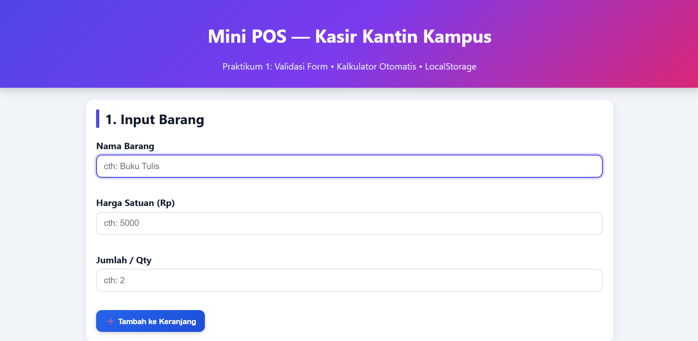
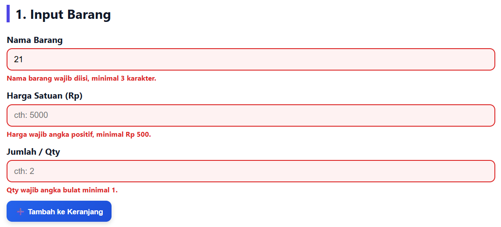
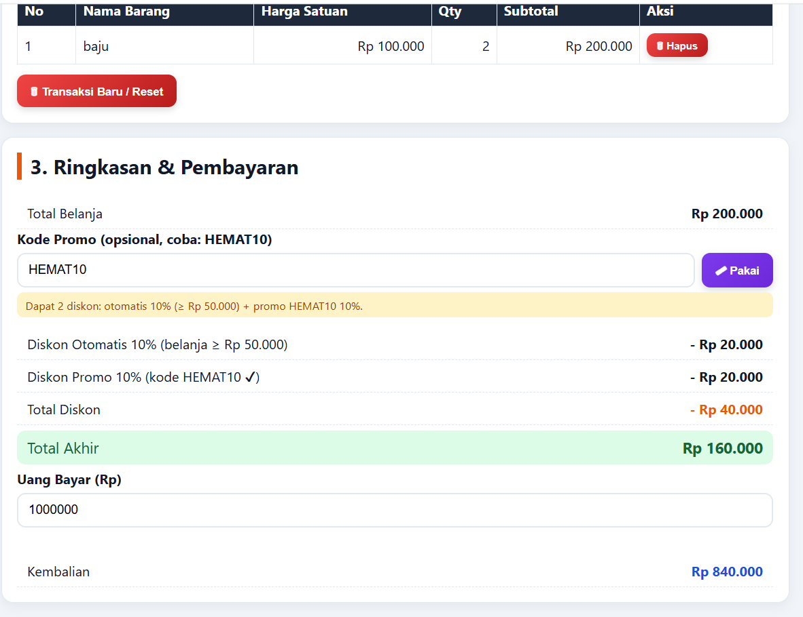

# Mini POS — Kasir & Keranjang Belanja Sederhana (Prak 1)

## Identitas
- **Nama Lengkap:** Erza Farandi
- **NIM:** 124140171
- **Kelas Praktikum:** RB

## Deskripsi Aplikasi
Aplikasi web kasir sederhana untuk kasir kantin / toko kampus. Studi kasus ini menyatukan tiga kompetensi dasar praktikum:
1. Validasi input form barang,
2. Perhitungan kalkulator otomatis (subtotal, total, diskon susun, kembalian),
3. Manajemen keranjang belanja berbasis `localStorage`.

Tujuan: kasir dapat menginput barang dengan validasi ketat, melihat total + diskon otomatis dan promo yang disusun, menghitung kembalian, dan data keranjang tidak hilang saat refresh.

## Panduan Menjalankan

### A. Lokal (Live Server / Browser)
1. Buka folder `Erza Farandi_124140171_pertemuan1` di VS Code.
2. Install extension **Live Server** (jika belum ada).
3. Klik kanan `index.html` → **Open with Live Server**.
4. Atau cara manual: double-klik `index.html` untuk dibuka di browser (Chrome/Edge).
5. Tidak perlu backend / database, cukup browser modern dengan JavaScript + localStorage aktif.

### B. Hosting GitHub Pages
1. Buat repository baru di GitHub (misal `MiniPOS-Prak1`), jangan centang Add README agar tidak konflik.
2. Di terminal, dari dalam folder proyek:
   ```bash
   git init
   git add .
   git commit -m "Mini POS Prak 1"
   git branch -M main
   git remote add origin https://github.com/USERNAME/NAMA-REPO.git
   git push -u origin main
   ```
   (Ganti `USERNAME/NAMA-REPO` dengan milikmu. Kalau folder ini sudah jadi repo, cukup `git add/commit/push`.)
3. Di GitHub, buka **Settings → Pages**.
4. Pada **Build and deployment**, pilih **Deploy from a branch**, Branch: `main`, Folder: `/ (root)`, lalu **Save**.
5. Tunggu ±1 menit, aplikasimu online di:
   `https://USERNAME.github.io/NAMA-REPO/`
6. Catat URL tersebut sebagai link pengumpulan.

## Link Hosting GitHub
`https://USERNAME.github.io/NAMA-REPO/` _(ganti dengan link aslimu setelah deploy)_

## Daftar Fitur
- [x] Validasi Nama Barang (wajib, min 3 karakter) + pesan merah di bawah input
- [x] Validasi Harga Satuan (angka, ≥ Rp 500) + cegah masuk keranjang jika invalid
- [x] Validasi Qty (bulat, ≥ 1) + form auto-reset jika sukses
- [x] Subtotal otomatis per baris (Harga × Qty)
- [x] Total belanja otomatis (sum semua subtotal)
- [x] Diskon Otomatis 10% jika total ≥ Rp 50.000 + label alasan
- [x] Kode promo `HEMAT10` untuk tambahan diskon promo 10% (bisa susun dengan otomatis)
- [x] Tampil rincian Diskon Otomatis + Diskon Promo + Total Diskon + Total Akhir
- [x] Input Uang Bayar + kembalian otomatis + warning jika kurang
- [x] Tabel keranjang (No, Nama, Harga, Qty, Subtotal, Aksi)
- [x] Hapus item per baris + hitung ulang otomatis
- [x] Simpan ke localStorage (`JSON.stringify`) + load (`JSON.parse`)
- [x] Tombol Transaksi Baru / Reset (kosongkan cart + localStorage)
- [x] Format Rupiah `Rp 1.000` + layout responsif + tombol berwarna interaktif

## Tangkapan Layar (Screenshot)

### 1. Form Utama


### 2. Saat Error / Tidak Valid


### 3. Diskon (Otomatis + Promo Susun)


## Penjelasan Teknis Singkat
- **Validasi:** `validateBarang(nama, harga, qty)` di `script.js` cek `nama.trim().length >= 3`, `harga >= 500`, `Number.isInteger(qty) && qty >= 1`. Jika gagal, isi `<small class="error">` + class `invalid`, lalu `return` tanpa push ke cart.
- **Kalkulator:** `calcTotals()` = `total` via `reduce(harga*qty)`, `diskonOtomatis = 10%` jika `total >= 50000`, `diskonPromo = 10%` jika kode `HEMAT10` valid (tombol Pakai), `diskon = keduanya dijumlah`, `totalAkhir = total - diskon`. Label alasan ditampilkan per baris. `calcKembalian()` = `bayar - totalAkhir`, tampilkan warning jika negatif.
- **LocalStorage:** `saveCart()` → `localStorage.setItem(KEY, JSON.stringify(cart))`, `loadCart()` → `JSON.parse(localStorage.getItem(KEY))`. Dipanggil setiap tambah/hapus/reset + saat init `renderCart()`.

## Struktur Folder
```
Erza Farandi_124140171_pertemuan1/
├── index.html
├── style.css
├── script.js
├── README.md
├── images/
│   ├── form_utama.png
│   ├── validasi_error.png
│   └── tampilan_diskon.png
└── modul/
    ├── latihan1/ (index.html + script.js)
    ├── latihan2/ (index.html + script.js)
    ├── latihan3/ (index.html + script.js)
    └── latihan4/ (index.html + script.js)
```
